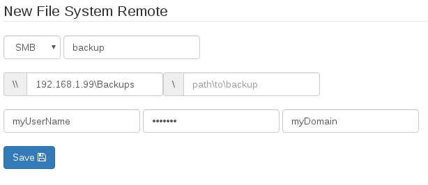

# Full backups

> Full backups are released since 4.3

You can schedule full backups of your VMs, by exporting them in the local XOA file-system, or directly in a NFS share. "Depth" parameter allow to modify the retention (removing the oldest one).

[](https://xen-orchestra.com/blog/backup-your-xenserver-vms-with-xen-orchestra/)

Full backups are space consuming! But they allow a very simple restoration without anything to think of (the file will contain all the VM disks and information).

## Remote stores

This where you can create your stores, places where your backups will be exported.


Supported stores:

* local stores (any folder in XOA filesystem)
* NFS
* SMB (CIFS)

### SMB

Just read twice the UI when you add a SMB store. If you have:

* `192.168.1.99` as SMB host
* `Backups` as folder
* no subfolder

You'll have to fill it like this:



**PATH TO BACKUP is only needed if you have subfolders in your share.**

### Other stores

If you need to mount an unsupported store, you could always do it manually:

1. mount your store inside XOA manually, e.g in `/media/myStore`
2. in the web interface, select a "local" store and point it to your `/media/myStore` folder.

Any Debian Linux mount point could be supported this way, until we add further options directly in the web interface.

## Restore backups

All your scheduled backup are acccessible in the "Restore" view in backup section of Xen Orchestra.

1. Select your mountpoint
2. Choose the file you want to restore
3. Select the host/pool you want to restore it


## About backup compression

By default, Backup are compressed (using GZIP, done in XenServer side). There is no absolute rule about using compression or not, but there is some rules.

Gzip compression is:

* slow
* space efficient
* consume less bandwidth (if your NFS share is far)

If you have compression on your NFS share (or destination file-system like ZFS), you can disable compression in Xen Orchestra.

Here is a network usage graph with 2 identical backup, the first one without compression:


## Add a disk for local backups

If you want to use XOA to store all your backups, you need to attach a large disk to it. This can be done in live.

First, after your disk is attached to XOA, you'll have to find the new disk name with `fdisk -l`. It's probably `xvdb`.

Then, create a filesystem on it:

```
mkfs.ext4 /dev/xvdb

```

If you already have backups done, you can move them to the new disk. The orignal backup folder is in `/var/lib/xoa-backups`.

To get the mount point persistent in XOA, edit the `/etc/fstab` file, and add:

```
/dev/xvdb /var/lib/xoa-backups ext4 defaults 0 0
```

This way, without modifying your previous scheduled snapshot, they will be written in this local mountpoint!
