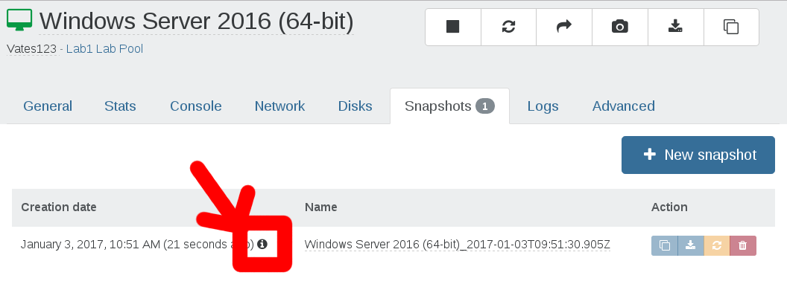
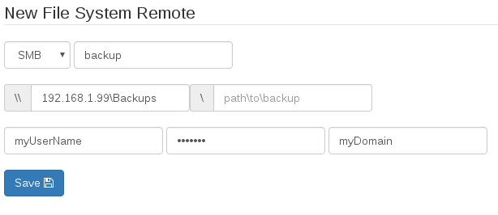

# Backups

This section is dedicated to any existing means to rollback or backup your VMs in Xen Orchestra.

There is different way to protect your VMs:

* [full backups](full_backups.md) [*Starter Edition*]
* [rolling snapshots](rolling_snapshots.md) [*Starter Edition*]
* [delta backups](delta_backups.md) (best of both previous ones) [*Enterprise Edition*]
* [disaster recovery](disaster_recovery.md) [*Enterprise Edition*]
* [continuous replication](continuous_replication.md) [*Premium Edition*]
* [file level restore](file_level_restore.md) [*Premium Edition*]

> Don't forget to take a look on the [backup troubleshooting](backup_troubleshooting.md) section. You can also take a look on the [backup reports](backup_reports.md) section for configuring notification.

There is also a way to select automatically VMs to backup: **[smart backup](smart_backup.md)** [*Enterprise Edition*]

## Overview

This is the welcome panel on the backup view. It recaps all existing scheduled jobs. This is also where the backup logs are displayed.

## Logs

All the scheduled operations (backup, snapshots and even DR) are displayed in the main backup view.

A successful backup task will be displayed in green, a faulty one in red. You can click on the arrow to see each entry detail:

You also have a filter to search anything related to these logs.

> Logs are not "live" tasks. If you restart XOA during a backup, the log associated with the job will stay in orange (in progress), because it wasn't finished. It will stay forever not finished because the job was cut in the middle.

## Consistent backup (with quiesce snapshots)

All backup are relying on snapshots. But what about data consistency? By default, Xen Orchestra will try to make a **quiesce snapshot** everytime a snapshot is done (and fallback to normal snapshot if it's not possible).

All your Windows VMs can be protected (especially MS SQL or Exchange services) after you have installed Xen tools in your VMs. A quiesce snapshots means the operating system will be notified and the cache will be flushed on disks. This way, your backups will be always consistent.

To see if you have quiesced snapshots for a VM, just go into its anapshot tab, the "info" icons means it is a quiesced snapshot:



The tooltip confirms this:


## Remotes

> Remotes are places where your *backup* and *delta backup* files will be stored.

To add a *remote*, go in **Settings/Remotes** menu.

Supported stores:

* local (any folder in XOA filesystem)
* NFS
* SMB (CIFS)


> **WARNING**: the initial "/" or "\\" is automatically added.

### NFS

On your NFS server, authorize XOA's IP and permissions for subfolders. That's all!

### SMB

We support SMB storage on *Windows Server 2012 R2*.

> WARNING: In continuous delta backup, SMB is **NOT** recommended (or only for small VMs, eg < 50GB)

Also, read twice the UI when you add a SMB store. If you have:

* `192.168.1.99` as SMB host
* `Backups` as folder
* no subfolder

You'll have to fill it like this:



**PATH TO BACKUP is only needed if you have subfolders in your share.**

### Local

> **This is for advanced users**. Using local XOA filesystem without extra mount/disk will **use the default system disk of XOA**.

If you need to mount an unsupported store, you could always do it manually:

1. mount your store inside XOA manually, e.g in `/media/myStore`
2. in the web interface, select a "local" store and point it to your `/media/myStore` folder.

Any Debian Linux mount point could be supported this way, until we add further options directly in the web interface.

## Restore backups

All your scheduled backup are acccessible in the "Restore" view in backup section of Xen Orchestra.

1. Select your remote and click on the eye icon to see available VMs
2. Choose the backup you want to restore
3. Select SR where you want to restore it

## About backup compression

By default, *Backup* are compressed (using GZIP, done in XenServer side). There is no absolute rule but in general not compressed backup are faster.

XenServer uses Gzip compression, which is:

* slow
* space efficient
* consume less bandwidth (if your NFS share is far)

If you have compression on your NFS share (or destination file-system like ZFS), you can disable compression in Xen Orchestra.

## Add a disk for local backups

If you want to use XOA to store all your backups, you need to attach a large disk to it. This can be done in live.

First, after your disk is attached to XOA, you'll have to find the new disk name with `fdisk -l`. It's probably `xvdb`.

Then, create a filesystem on it:

```
mkfs.ext4 /dev/xvdb

```

If you already have backups done, you can move them to the new disk. The orignal backup folder is in `/var/lib/xoa-backups`.

To get the mount point persistent in XOA, edit the `/etc/fstab` file, and add:

```
/dev/xvdb /var/lib/xoa-backups ext4 defaults 0 0
```

This way, without modifying your previous scheduled snapshot, they will be written in this local mountpoint!
