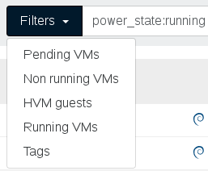

# Live filter search

The idea is not just to provide a good search engine, but also a complete solution for managing all your XenServer infrastructure. Ideally:

* less clicks to see or make what you want
* find a subset of interesting object
* make bulk actions on all results found
* sort your result for more pertinent insight

> Pro Tip: the URL of Xen Orchestra contains the search string, eg `home?s=power_state%3Arunning+`. You can share those URL to your colleagues to share your search!

## Search examples

We recorded some filters in the dropdown "Filters":

You can also use other filters here:

## Save your search

If you want to record your filter, just click on "Save" icon 

After giving a name to your filter, you can find it in the dropdown filter menu.

## Manage your saved search

Just go in your user zone (bottom of main left menu):

There, you can edit or remove any filter/search your created!

## Make a default search

In this user zone, you can set a default filter (preset filters or your own).

> Pro Tip: this is saved in your user preference. It means that you can connect anywhere on any browser, you'll find your preference.

## Filter syntax

> A filter allows you to search through a collection of objects which have multiple properties and may even contains other nested objects.

#### Searching for a string (or substring)

Simply write the string, if it contains special characters just surround it with quotes:

- `simple-string`
- `"string with special characters like whitespaces"`

> The search is recursive, case insensitive and non-anchored (i.e. matches if the pattern is contained in a string).

#### Searching a specific property

Write the property name, followed by a colon `:` and a subfilter:

- `name_label:"my VM"`
- `virtualizationMode:hvm`
- `boot:order:cn`

#### Negation

Prefix your filter with an exclamation mark `!`:

- `!hvm`
- `!power_state:Running` or `power_state:!Running`

#### Intersection

Simply write filter's terms side by side:

- `power_state:Halted !virtualizationMode:hvm`

#### Grouping

Parentheses can be used to group terms together:

- `!(power_state:Running virtualizationMode:hvm)`

#### Union

Pipe `|` followed by a group of terms:

- `|(vm1 vm2)`
- `power_state:|(Running suspended)`

#### Truthy property

This one is less common but can be used to check whether a property has a truthy value (`true`, non-empty string or non-zero number).

Postfix the name of a property by an question mark `?`:

- `auto_poweron?`
- `high_availability?`

## Available properties

No documentation on this side either, but you can see all objects and their properties using `xo-cli --list-objects`.

Take a look at [the documentation](https://github.com/vatesfr/xen-orchestra/tree/master/packages/xo-cli#xo-cli) :)

For the Xen Tools status:

- `xenTools?`: whether the tools are installed
- `xenTools:"up to date"`: whether they are installed and up to date
