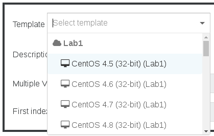
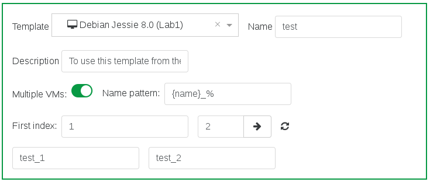

# VM creation

## Create a new VM

A new VM can be created via the "New" item in the main menu (bottom):

Or in the home view:

## Wizard

### Select your Pool

Because Xen Orchestra can be connected to multiple pools, you must select on which one you want to create your VMs:

On which **host** the VM will actually run will depend of various settings (local SR or not, RAM available etc.)

### Infos category

#### Select your template

The next step is to select a template:

> What is a XenServer template? It could be 2 things: first an "empty" template, meaning containing only configuration for your future VM, like guiding you for some info (minimum disk size, RAM and CPU, BIOS settings if HVM etc.) Or it could be a previous VM you converted into a template: in this case, creating a VM will clone existing disks.

#### Name and description

Those values can be changed anytime after your VM is created.

#### Multiple VMs

You can create multiple VMs at one here, if you toggle the option. The `{name}` pattern is the "Name" field of the VM. By default, it will start with number 1 and so on. You can change this via the "First index" label.

Click on refresh icon to take the change into account:

### Performances

This is where you are configuring VM performances: number of vCPUs, RAM, CPU weight and cap.

#### CPU weight and cap

CPU weight default number is `256`. It means that it will be scheduler by Xen like any other VMs on the host where it runs. If you raise it, eg with `512`, CPUs on this VM will be scheduled twice more than another one. If you diminish it, with `64` for example, it will be schedule 4 times less.

What about cap? It's the maximum amount of CPUs a VM can consume. It's using a 100 base (1 vCPU: 100). Default is 0 and means no upper cap.

> Should I mess with these settings? In general: nope. It's only when you are sure of what are you doing. More can be found here: https://wiki.xen.org/wiki/Credit_Scheduler

### Install settings

Depending of your template type (with existing disks or not, PV vs HVM) this panel can be changed.

#### HVM templates without existing disks

You can choose to boot on a ISO or using PXE:

#### PV templates

Those templates will use PV configuration in order to boot: either from the right ISO or network URL. PV Args can be used to modified kernel parameters, but it's a very advanced setting you shouldn't play with.

#### Template with existing disks

Because there is already disks installed, you shouldn't have "Install settings" *per se*. But you can use our Config drive setup if your template already have CloudInit installed!

Please refer to the [XenServer CloudInit section](cloudinit.md) for more.

### Interfaces

This is the network part of the VM configuration: in general, MAC field is kept empty (autogenerated from XenServer). We also select the management network by default: you can change it reflecting your own network configuration.

### Disks

This section is for configuring new or existing disks (according to your selected template).

> Protip: avoid using large disks for your VMs. Want to store a lot of files? Use a network share for that (NFS, SMB) and keep using VMs with small system disks. It's far easier to maintain, migrate, backup and restore!
