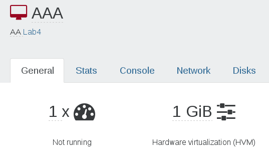
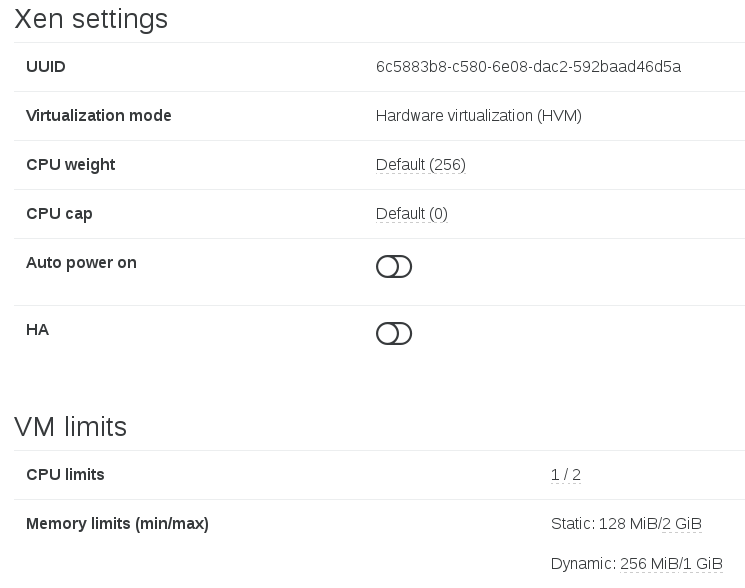

# VM management

## Live Edition

Any object with a dotted underline can be editer on mouse click: VM title, description, CPU and memory.

In advanced tab, you have extra options:

### XenServer limitations

* each VM has a vCPU maximum number. This value can't be change while the VM is running. You can reduce the number of vCPUs, but can't assign more than max. In XO, while your VM is halted, allow the max vCPUs you would need, then boot it. Now you can reduce it and then expand it later to this maximum.
* the same limitation apply for the static RAM.

You can learn more about XenServer resource management here: https://wiki.xenserver.org/XCP_FAQ_Dynamic_Memory_Control

## VDI live migration

Thanks to Xen Storage Motion, it's easy to move a VM disk from a storage to another, while the VM is on! This feature can help you to migrate from your local storage to a SAN, or just upgrade your SAN without any downtime.

To do that: go inside your running VM, then in the the Disk tab. Make a long click on the current SR of the disk, a dorpdown menu will be displayed with all compatible destinations. Just select it, that's all: the migration will start in live!

### Offline VDI migration

Despite it's not currently supported in XenServer, we managed to do it in Xen Orchestra. It's exactly the same process than for a running VM.

## VM recovery

In advanced tab, the "Recovery start button":

This button will allow you to boot directly on the CD drive, ignoring your current disks. Note that it works for all virtualization modes: HVM or PV.

## Auto power VM

Activate "Auto Power on" on a VM will also configure the pool accordingly. If your host is rebooted, the VM will be started right after the host is up.

## VM high availability (HA)

If you pool support HA (need a shared storage), you can activate "HA". Read our blog post for more details on [VM high availability on XenServer](https://xen-orchestra.com/blog/xenserver-and-vm-high-availability/).

### Docker management

> Please [read the dedicated section](docker_support.md) to install a Docker Ready VM.

### VM CPU priority

You can change the CPU Weight in the VM advanced view. Values are:

* Default
* Quarter (64)
* Half (128)
* Normal (256 in fact)
* Double (512)

By default, each VM has a weight of 256.

If one VM got for example, "Double", it will have double priority for the Xen scheduler. [Read more on the official Citrix XenServer documentation](http://support.citrix.com/article/CTX117960).

### VM Copy

VM copy allow to make an export and an import in streaming. You can target any SR in your whole XenServer infrastructure (even across different pools!)

### Snapshots management

You can create a snapshot in one click. It will be named automatically. After the snapshot is created, you can either:

* export it on your computer
* revert your VM to this snapshot (it will restart the VM)
* delete this snapshot

> By default, XOA will try to make a snapshot with quiesce. If the VM do not support it, it will fallback to the default snapshot system.
