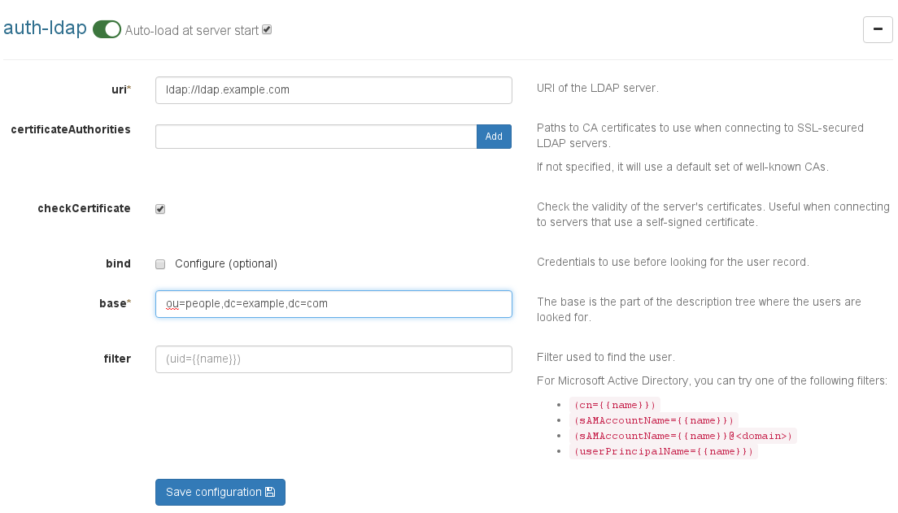

# LDAP

XO currently support connection to LDAP directories, like *Open LDAP* or *Active Directory*.

To configure your LDAP, go need to go in the *Plugins* section in the "Settings" view. Then configure it:



Don't forget to save the configuration, and also check if the plugin is activated (green button on top).

## Filters

LDAP Filters allow you to match properly your user. It's not an easy task to always find the right filter, and it's entirely depending of your LDAP configuration. Still, here is a list of common filters:

* `'(uid={{name}})'` is usually the default filter for *Open LDAP*
* `'(cn={{name}})'`, `'(sAMAccountName={{name}})'`, `'(sAMAccountName={{name}}@<domain>)'` or even `'(userPrincipalName={{name}})'` are widely used for *Active Directory*. Please check with your AD Admin to find the right one.

After finishing the configuration, you can try to log in with your LDAP username and password. Finally, right after your initial successful log in, your account will be visible in the user list of Xen Orchestra.

## Debugging

If you can't log in with your LDAP settings, please check the logs of `xo-server` while you attempt to connect. It will give you hints about the error encountered. You can do that with a `tail -f /var/log/syslog -n 100` on your XOA.

## Missing plugin?

If you don't find the LDAP plugin in the list, be sure to have it displayed in your Xen Orchestra configuration (in `/etc/xo-server/config.yaml`):

```
plugins:

  auth-ldap:
```

If it's not the case, don't forget to restart the service after your modification, with `systemctl restart xo-server.service`.