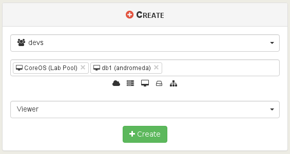
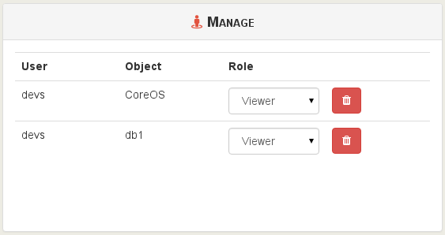

# Resources delegation

This chapter is about how to delegate resources (VM, hosts) to users.

The idea is to allow external users (not admins) to:

* interact only with their objects
* delegate VMs to your dev teams...
* ... or to your clients

> Remember: admins can do everything, thus permissions don't apply on them. It's only for *users*.

## Groups

Groups are a set of users. You can use groups to apply permissions/ACLs on a whole set of users, instead of repeating superfluous operations on multiple users separately.

Groups can be created and managed in the "Groups" view inside "Settings" menu.

1. Create a group by giving it a name
2. Edit this group and add users in it

Any group can be edited as you like after its creation.

## ACLs

ACLs are the permissions for your users or groups. The ACLs view can be accessed in the "Settings".

1. Select the user or group you want to apply permissions on it
2. Select the object on which the permission will apply
3. Choose the role for this ACL
4. Click on "Create"

> Pro tip: you can click to add multiple objects at the same time!

Your ACL is now available in the right list:

You can edit/remove existing ACLs here.

### Roles

There is 3 different roles for your users:

* Admin
* Operator
* Viewer

#### Admin

An object admin can do everything on it, even destroy it. E.g with its admin VM:

* create a new VM
* remove it
* migrate it (to a host with admin permission on it)
* modify the VM resources, name and description
* clone it
* copy it
* convert it into a template
* snapshot it (even revert from a snapshot)
* export it
* attach/add visible disks
* same for network cards

#### Operator

An operator can make everyday operations on assigned objects. E.g on a VM:

* eject a CD
* insert a CD (if he can view the ISO storage repository)
* start, restart, shutdown, suspend/resume it

All other operations are forbidden.

#### Viewer

A viewer can only access the object console (if any) and see the object metrics. That's all!

### Inheritance

Objects have a hierarchy: a Pool contains all its hosts, containing itself all its VMs.

If you give a *view* permission to a user (or a group) on a pool, he will automatically see all the objects inside this pool (SRs, hosts, VMs).

### Examples

#### Allow a user to install an OS

If the OS install needs a ISO, you need to give this user 2 permissions:

* *Operate* on the VM (e.g to start it)
* *View* on the ISO Storage containing the needed ISO.

#### Console only

If you want to give your user access to the VM console only, the *View* permission is enough.